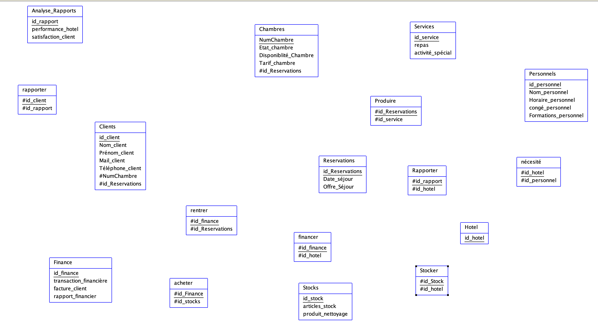

voici le dictionnaire de données :


voici le MCD :


voici le MLD :


j'utilise azur data studio avec docker pour la base de données

les script sql pouyr la création de la base de données :
```sql
CREATE TABLE Clients(
    id_client INTEGER PRIMARY KEY,
    Nom_client VARCHAR(30) NOT NULL,
    Prénom_client VARCHAR(30) NOT NULL,
    Téléphone_client INTEGER NOT NULL,
    Mail_client VARCHAR(20) NOT NULL
    FOREIGN KEY (NumChambre) REFERENCES Chambres(NumChambre),
    FOREIGN KEY (id_Reservations) REFERENCES Reservations(id_Reservations)
);
```
```sql
CREATE TABLE Chambres(
    NumChambre INTEGER PRIMARY KEY,
    Tarif_chambre INTEGER NOT NULL,
    Etat_Chambre VARCHAR(100) NOT NULL,
    Disponiblilité_chambre BOOLEAN NOT NULL,
    FOREIGN KEY (id_Reservations) REFERENCES Reservations(id_Reservations)
);
```
```sql
CREATE TABLE Reservations(
    id_Reservations INTEGER PRIMARY KEY,
    Date_Séjour DATE NOT NULL,
    Offre_Séjour DATE NOT NULL,
);
```
```sql
CREATE TABLE Stocks(
    id_stock INTEGER PRIMARY KEY,
    articles_stocks VARCHAR(255) NOT NULL,
    produit_nettoyage VARCHAR(255) NOT NULL,
    FOREIGN KEY (id_Reservations) REFERENCES Reservations(id_Reservations)
);
```
```sql
CREATE TABLE Personnels(
    id_Personnels INTEGER PRIMARY KEY,
    Nom_personnel VARCHAR(30) NOT NULL,
    Horaire_personnel DATETIME NOT NULL,
    congés_personnel DATE NOT NULL,
    Formation_personnel VARCHAR(255) NOT NULL,
);
```
```sql
CREATE TABLE Finance(
    id_Finance INTEGER PRIMARY KEY,
    transaction_financière VARCHAR(255) NOT NULL,
    facture_client VARCHAR(255) NOT NULL,
    rapport_financier VARCHAR(255) NOT NULL,
);
```
```sql
CREATE TABLE acheter
(
    FOREIGN KEY (id_stock) REFERENCES Stocks(id_stock),
    FOREIGN KEY (id_Finance) REFERENCES Finance(id_Finance)
);
```

je n'ai pas eu le temps finir toutes les requetes des tables mais c'est comme celle de en haut


