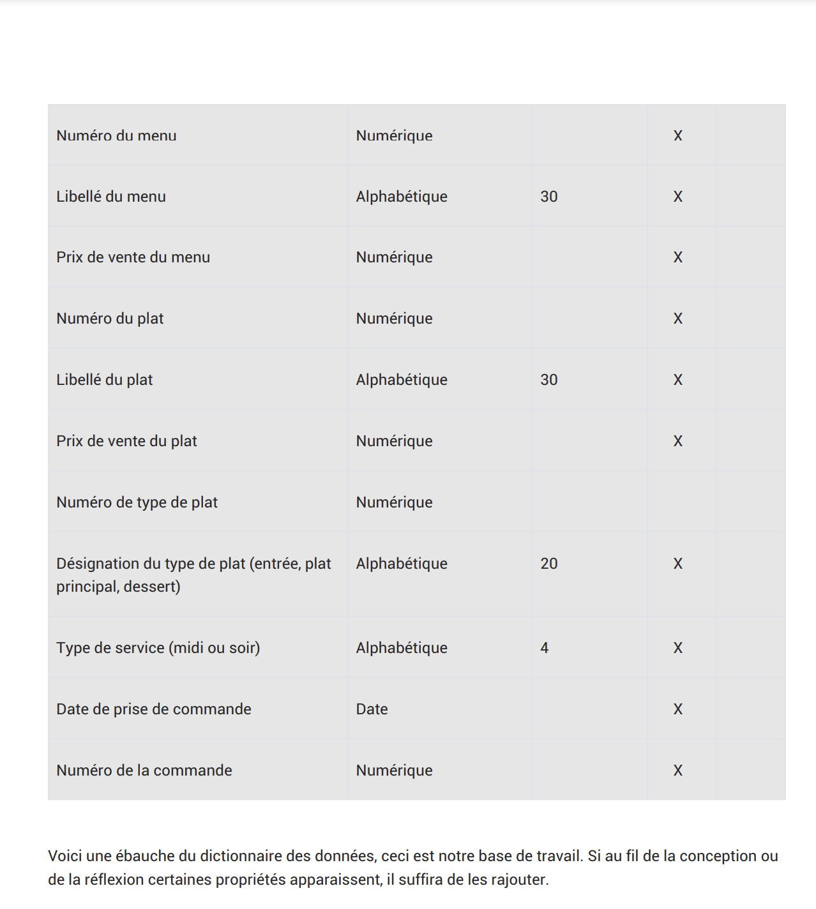
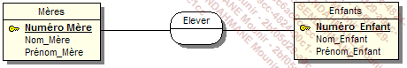

<h1>Modélisation de donnée</h1>

## 1. Initialisation de git avec VS code

la commande :
``` sh
git init
```
nous permet de créer un depot git dans le dossier dans lequel ont travail

la commande :
``` sh
git status
```
nou permet de verifier que l'on a bien sauvegarder

Pour ajouter des fichiers non suivis :
```` bash
git add .
````

pour sauvegarder le travail commande :
``` bash
git commit -m "votre message de commit"
```

## 2. MERISE

Merise est une methde de modélisation de données. elle permet de représenter les données d'un systeme d'information.

Mersie est acronyme de : Méthode d'Etude et de Réalisatuion Informatique pour les systemes d'Entreprise.

Présentation Général
Cette methiode se caractérise par trois point clés:
- une approche dite systemique : on transforme les processus de l'entreprise en systelme d'information
- une séparation des donnnées et des traitements
- une approche nivelée

### 2.1 L'approche systemique


Systeme de pilotage : 

- Il compose de l'ensemble des acteurs qui vont **piloter** le systeme d'information

systeme d'information :

- Il est composé de l'ensemble des acteurs qui vont **utiliser** le systeme d'information

le systeme operant :

- Il est compose de l'ensemble des acteurs qui vont **produire** les données su systeme d'information

### 2.2 La séparation des données et de traitements

La séparation des données et des traitementspermet de séparer les données du systeme d'informations et mles traitements effectués sur ces données.
Cette démarche se fait en 3 étapes :
- L'analyse des flux : on analyse les flux d'informations entre les acteurs du systeme d'information et les acteurs du systeme operant
- L'etude des documents interne (factures,bon de livraison,)
- M'etude des documents en externes (fournisseur, clients,)

Les differents types de d'informations:

- les infos de bases ou elementaire : ce sont les données de base du systeme d'information
- les informations calculées : ce sont les données calculées a partir des données de base
- les traitements ou les fonctions : ce sont les traitements effectués sur les donées de base pour obtenir les données calculées

En resume : vous devrez identifiiéses les données et les traitements effectués sur ces données.

### 2.3 L'approche nivelée

Pour effectuer la conception d'un SI, on va utiliser une approche nivelée. Cette approchze se compose de 4 niveaux :
- Le niveau conceptuel 
- Le niveau organisationnel
- Le niveau logique 
- Le niveau physique

### 2.4 Le niveau conceptuel

Le niveau conceptuel permet de modéliser les données de l'entreprise, 
On va utiliser le conceptuel de données (MCD) pour modéliser les données de l'entreprise, et le MTC pour modéliser les traitements effectués sur ces données.

### 2.5 Le niveau organisationnel

Le niveau organisationnel va permattre d'intergrer a l'analyse précédente toutes les notions de temporalite , de chronologie des operation s, de contraintes geographiques. On va utiliser le modele organisationnel deds traitements (MOT) et le modele organisationnel des données (MOD) pour modéliser les traitements de l'entreprise.

En résume on se pose les questionq suivantes a partire des données recuillies au niveau conceptuel :
- **Quand** les traitement sont-ils effectués ?
- **Où** les traitements sont-ils effectués ?
- Par **qui** les traitements sont-ils effectués ?

### 2.6 Le niveau logique

le niveau logique va permettre de modéliser les données de l'entreprise en utilisant le modèle logique de données (MLD) et les tratements de l'entreprise en utilisant le modèle logique des traitements (MLT).

Le MLD est independant des langages de programation et des SGBD (Système de Gestion de Base de Données).

On repond a la question : **Avec quoi** les traitements sont-ils effectués ?

### 2.7 Le niveau physique

Il s'agit de l'oganisation `réelle` des données. On va utiliser le modèle physique des données (MPD) et le modèle physique des traitements (MPT).

Ici, on apporte les solutions techniques de stockage des do nnées et de traitementrs des données.

On repond a la question : **Comment** les traitements sont-ils effectués ?

### 2.8 les 4 niveau de Mérise


## 3. Des données aux dependances fonctionnelles

Pour être intégrées dans un systeme d'informations, les données doivent être triées et organisées. On va souvent tenter de les classer par type de données :

- chaines de caractères, format texte
- type alplanumérique, format texte
- le type numérique (integer, float...)
- le type date (datetime, timestamp)
- le logique ou booléen (true, false)


Tableau :

| Nom de la données | format | Longueur |  type | Règle de calcul | Règle de gestion | Document |
|-------------------|--------|----------|---|---|---|---|
|Numéro|int|10|élementaire|||fiche|
|Nom|varchar|255|élementaire|||fiche|
|Prénom|varchar|255|élementaire|||fiche|
|adresse|varchar|255|élementaire|||fiche|
|code postal|varchar|6|élementaire|||fiche|
|ville|varchar|100|élementaire|||fiche|
|Téléphone|varchar|20|élementaire|||fiche|
|mail|varchar|255|élementaire|||fiche|
|Date d'adhésion|date|255|élementaire|||fiche|


## 4. Les dépendances fonctionnelles

Une dépendance fonctionnelle est une relation entre deux attributs d'une table.
Elle permet de definir une relation de dependance entre deux attributs d'une table.




le but de l'exercice est d'élabeurer un MCD a partir d'un diagramme de données.

Ici on va introduire les notions d'entité, de relation et de propriétés.

Les rpopriétés sont les informations de bases d'un SI.

Les entités sont les objets du SI. 


### 4.1 Les relations

les relations sont lien avec les entité par des verbes.


### 4.2 Les cardinalités

**Les cardinalité**: elle permettent de définir le nombre d'occurences d'une entité par rapport a une autre entité dans le cadre d'une relation.


Petit exemple :





quelques regles de conception :

- toute entite doit avoir un identifiant
-toutes les propriétés dépendent fonctionnelement de l'identifiant
- le nom d"une propriété ne doit aparraitre qu'une seule fois dans le MCD : si vous avez une entité eleve et une entité professeur, vous ne pouvez pas avoir une propriété nom dans les deux entités. il faut donc renommer la propriété nom de l'entité professeurProfeseur en NomProfesseur par exemple.
- les propriété issues d'un calcul ne doivent pas apparaitre dans le MCD.
