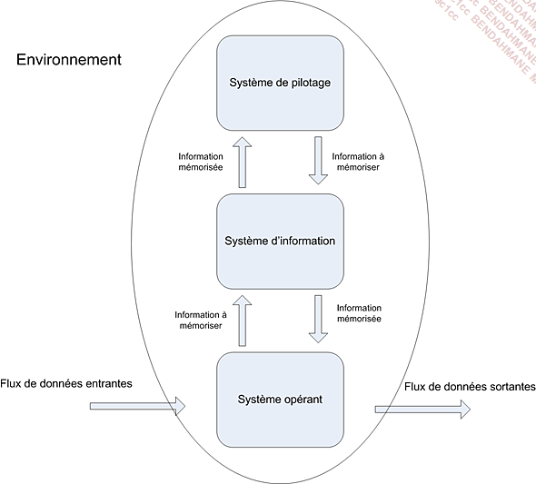

<h1>Modélisation de donnée</h1>

## 1. Initialisation de git avec VS code

la commande :
``` sh
git init
```
nous permet de créer un depot git dans le dossier dans lequel ont travail

la commande :
``` sh
git status
```
nou permet de verifier que l'on a bien sauvegarder

Pour ajouter des fichiers non suivis :
```` bash
git add .
````

pour sauvegarder le travail commande :
``` bash
git commit -m "votre message de commit"
```

Pour recuperer les sauvegarde d'un depot git la commande :
``` bash
git pull
```

## 2. MERISE

Merise est une methde de modélisation de données. elle permet de représenter les données d'un systeme d'information.

Mersie est acronyme de : Méthode d'Etude et de Réalisatuion Informatique pour les systemes d'Entreprise.

Présentation Général
Cette methiode se caractérise par trois point clés:
- une approche dite systemique : on transforme les processus de l'entreprise en systelme d'information
- une séparation des donnnées et des traitements
- une approche nivelée

### 2.1 L'approche systemique



Systeme de pilotage : 

- Il compose de l'ensemble des acteurs qui vont **piloter** le systeme d'information

systeme d'information :

- Il est composé de l'ensemble des acteurs qui vont **utiliser** le systeme d'information

le systeme operant :

- Il est compose de l'ensemble des acteurs qui vont **produire** les données su systeme d'information

### 2.2 La séparation des données et de traitements

La séparation des données et des traitementspermet de séparer les données du systeme d'informations et mles traitements effectués sur ces données.
Cette démarche se fait en 3 étapes :
- L'analyse des flux : on analyse les flux d'informations entre les acteurs du systeme d'information et les acteurs du systeme operant
- L'etude des documents interne (factures,bon de livraison,)
- M'etude des documents en externes (fournisseur, clients,)

Les differents types de d'informations:

- les infos de bases ou elementaire : ce sont les données de base du systeme d'information
- les informations calculées : ce sont les données calculées a partir des données de base
- les traitements ou les fonctions : ce sont les traitements effectués sur les donées de base pour obtenir les données calculées

En resume : vous devrez identifiiéses les données et les traitements effectués sur ces données.

### 2.3 L'approche nivelée

Pour effectuer la conception d'un SI, on va utiliser une approche nivelée. Cette approchze se compose de 4 niveaux :
- Le niveau conceptuel 
- Le niveau organisationnel
- Le niveau logique 
- Le niveau physique

### 2.4 Le niveau conceptuel

Le niveau conceptuel permet de modéliser les données de l'entreprise, 
On va utiliser le conceptuel de données (MCD) pour modéliser les données de l'entreprise, et le MTC pour modéliser les traitements effectués sur ces données.

### 2.5 Le niveau organisationnel

Le niveau organisationnel va permattre d'intergrer a l'analyse précédente toutes les notions de temporalite , de chronologie des operation s, de contraintes geographiques. On va utiliser le modele organisationnel deds traitements (MOT) et le modele organisationnel des données (MOD) pour modéliser les traitements de l'entreprise.

En résume on se pose les questionq suivantes a partire des données recuillies au niveau conceptuel :
- **Quand** les traitement sont-ils effectués ?
- **Où** les traitements sont-ils effectués ?
- Par **qui** les traitements sont-ils effectués ?

### 2.6 Le niveau logique

le niveau logique va permettre de modéliser les données de l'entreprise en utilisant le modèle logique de données (MLD) et les tratements de l'entreprise en utilisant le modèle logique des traitements (MLT).

Le MLD est independant des langages de programation et des SGBD (Système de Gestion de Base de Données).

On repond a la question : **Avec quoi** les traitements sont-ils effectués ?

### 2.7 Le niveau physique

Il s'agit de l'oganisation `réelle` des données. On va utiliser le modèle physique des données (MPD) et le modèle physique des traitements (MPT).

Ici, on apporte les solutions techniques de stockage des do nnées et de traitementrs des données.

On repond a la question : **Comment** les traitements sont-ils effectués ?

### 2.8 les 4 niveau de Mérise


## 3. Des données aux dependances fonctionnelles

Pour être intégrées dans un systeme d'informations, les données doivent être triées et organisées. On va souvent tenter de les classer par type de données :

- chaines de caractères, format texte
- type alplanumérique, format texte
- le type numérique (integer, float...)
- le type date (datetime, timestamp)
- le logique ou booléen (true, false)


Tableau :

| Nom de la données | format | Longueur |  type | Règle de calcul | Règle de gestion | Document |
|-------------------|--------|----------|---|---|---|---|
|Numéro|int|10|élementaire|||fiche|
|Nom|varchar|255|élementaire|||fiche|
|Prénom|varchar|255|élementaire|||fiche|
|adresse|varchar|255|élementaire|||fiche|
|code postal|varchar|6|élementaire|||fiche|
|ville|varchar|100|élementaire|||fiche|
|Téléphone|varchar|20|élementaire|||fiche|
|mail|varchar|255|élementaire|||fiche|
|Date d'adhésion|date|255|élementaire|||fiche|


## 4. Les dépendances fonctionnelles

Une dépendance fonctionnelle est une relation entre deux attributs d'une table.
Elle permet de definir une relation de dependance entre deux attributs d'une table.


le but de l'exercice est d'élabeurer un MCD a partir d'un diagramme de données.

Ici on va introduire les notions d'entité, de relation et de propriétés.

Les rpopriétés sont les informations de bases d'un SI.

### Lesentités sont les objets du SI. 


Quelque definitions :
    - ebntite forte: une entite qui ne depend pas d'une autre entité pour exister
    - entité faible: une entité qui depend d'une autre entité pour exister


Le role d'une dépendance focntionelle est de permettre de définir une relation de dependance entre deux attributs d'une table: une données A dépends fonctionnellement d'une données B lorsque la valeur de B Détermine la valeur A

Pour formaliser une dépendance fonctionnelle, on utilise la notation suivante :
 `Numero adhérent(nom, prenom, code postal, ville téléphone, dare d'adhésion, mail)`
 La partue gauche (numero adherent) est la `source` de la dependance fonctionnelle et
 la partie droite est le `but` de la dependance fonctionnelle.

#### 4.0.1 Les dependances fonctionnelles composées

Si une dependance fonctionnelle qui fait intervenir plusieurs attributs, on parle de dependance fonctionnelle composée.

Exemple: Pour connaitre le temps coureur sur un etape donnée il nous faut son numéro ou  son nom et le numéro de l'etape ainsi que le nom ou le numero de l'etape.

Formalisation : 
`(numero coureur, numero etape)`

#### 4.0.2 Les dependances fonctionnelles elementaires

Une dependances foncitonelle A -> B est elementaire s'il n'existe pas 
Une données C, sous - ensemble de A, décrivant une dependance fonctionnelle type C -> B.

Exemple :
- RefProduit -> LibelleProduit
- NumCommande RefProduit -> QuantiteCommandée
- <strike>NumCommande RefProduit -> DesignationProduit</strike>

#### 4.0.3 Les dependances fonctionnelle elementaire directe
"On dit que la dependance fonctionnelle A -> B est directe s'il n'existe aucun attribut C tel que l'on puisse avoir A -> C et C -> B.
En autre thermes, cela signifie que mla dependance fonctionnelle entre A et B ne peut pas être obtenue par transitivité."

Exemple :
 - RefPromo -> NumApprenant
 - NumApprenant -> NomApprenant
 - RefPromo -> NomApprenant : RefPromo -> NumApprenant -> NomApprenant

### 4.1 Les relations

les relations sont lien avec les entité par des verbes.


### 4.2 Les cardinalités

**Les cardinalité**: elle permettent de définir le nombre d'occurences d'une entité par rapport a une autre entité dans le cadre d'une relation.


Petit exemple :


### 4.3 Les relations "porteuses"

Une relation est dites porteuse si elle contient une propriété.
image 15 et 16

### 4.4 Les relations reflexives 

Une relation est dites reflexive si elle relie une entité a elle même.

image 17

### 4.5 quelques regles de conception :

- toute entite doit avoir un identifiant
-toutes les propriétés dépendent fonctionnelement de l'identifiant
- le nom d"une propriété ne doit aparraitre qu'une seule fois dans le MCD : si vous avez une entité eleve et une entité professeur, vous ne pouvez pas avoir une propriété nom dans les deux entités. il faut donc renommer la propriété nom de l'entité professeurProfeseur en NomProfesseur par exemple.
- les propriété issues d'un calcul ne doivent pas apparaitre dans le MCD.

### 4.6 Les contraintes d'intégrité fonctionnelle (GIF)

Définition : Une CIF est définie par le fait qu'une des entités de l'association est completement déterminée par la connaissance d'une ou de plusieurs entité particpant a l'association

Exemple :
image 18

une Salle peut contenir 0 ou plusieurs ordinateurs.
Un ordinateur existe dans une seule et unique salle.
Dans ce type de relation une CIF existe si on a uen  cardinalité 1,1.


## 5. Modele Logique de données (MLD)

Le MLD est l    a suite du processus Merise, on se raproche un peu plus de la base de données.

#### 5.0.1 cas simple
Partons du MCD suivant :


Nous arrivons au MLD suivant :


L'`entité` qui possède la cardilatité 1,1 ou 0,1 absorbe l'identifiant de l'entite lka plus fortez (0,n ou1,n). Cet identifiant devient alors une clé étrangère.

#### 5.0.2 cas (0,n), (0,n) ou (1,n), (1,n)

Partons du MCD suivant :


Dans le cas ou la `cardinalité` est n des deux cotés, on crée une entité intermediaire qui va contenir les deux clés etrangères des deux entités.


continuons avec le MCD suivant :


On obtient le MLD suivant la même logique :


#### 5.0.3 cas d'une relation reflexive

Partons du MCD suivant :


#### 5.0.4 Rgle de passage d'un MCD au MLD

resumé des partie précédente


## Exercice Pratique
 
Pour tous les excercices j'ai utilisé `Docker` avec `Azure Data Studio`.
### Exercice 1 :

Image MCD :


Image MLD :


```sql

CREATE TABLE Legumes
(
    id_legume INTEGER PRIMARY KEY,
    nom_legume VARCHAR(20) NOT NULL,
    poid_legume FLOAT NOT NULL,
);

```
```sql

CREATE TABLE Animaux
(
    id_animaux INTEGER PRIMARY KEY,
    nom_animaux VARCHAR(20) NOT NULL,
    poid_animaux FLOAT NOT NULL,
);

```
```sql

CREATE TABLE Fruits
(
    id_fruit INTEGER PRIMARY KEY,
    nom_fruit VARCHAR(20) NOT NULL,
    poid_fruit FLOAT NOT NULL,
);

```
```sql
CREATE TABLE Ventes
(
    id_client INTEGER PRIMARY KEY,
    nom_client VARCHAR(20) NOT NULL,
    prix_vente FLOAT NULL,
    Quantité FLOAT NULL,
    id_legume INTEGER,
    id_animaux INTEGER,
    id_fruit INTEGER,
    FOREIGN KEY (id_legume) REFERENCES Legumes(id_legume),
    FOREIGN KEY (id_animaux) REFERENCES Animaux(id_animaux),
    FOREIGN KEY (id_fruit) REFERENCES Fruits(id_fruit)
);

```

### Exercice 2 :

Image MCD :


Image MLD :


```sql
CREATE TABLE Propriétaires
(
    id_propriétaire INTEGER PRIMARY KEY,
    Nom_propriétaire VARCHAR(20) NOT NULL,
    Prénom_propriétaire VARCHAR(20) NOT NULL,
    Téléphone_propriétaire VARCHAR(20) NOT NULL,
    id_maison INTEGER NOT NULL,
    FOREIGN KEY (id_maison) REFERENCES Maisons(id_maison)
);

```
```sql
CREATE TABLE Locataires
(
    id_locataire INTEGER PRIMARY KEY,
    Nom_locataire VARCHAR(20) NOT NULL,
    Prénom_locataire VARCHAR(20) NOT NULL,
    Téléphone_locataire VARCHAR(20) NOT NULL,
    id_maison INTEGER NOT NULL,
    FOREIGN KEY (id_maison) REFERENCES Maisons(id_maison)
);

```
```sql
CREATE TABLE Maisons
(
    id_maison INTEGER PRIMARY KEY,
    Adresse_maison VARCHAR(20) NOT NULL,
    Code_postal_maison VARCHAR(20) NOT NULL,
    Prix_maison FLOAT NOT NULL,
);

```


